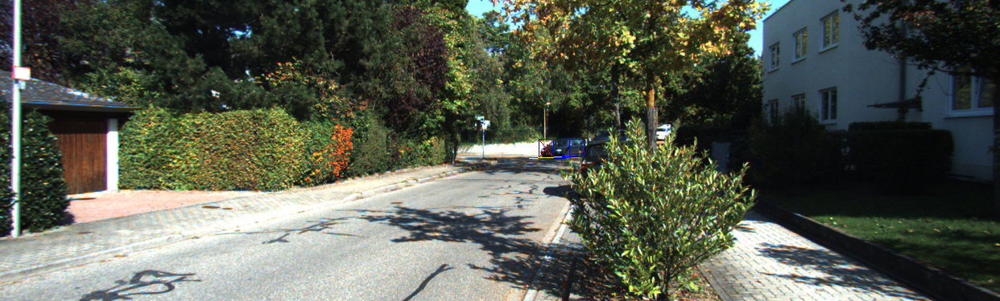
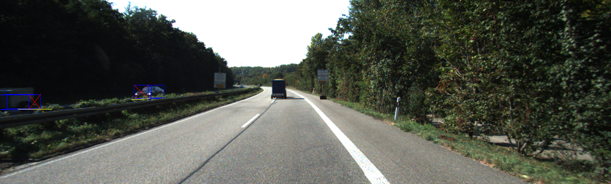
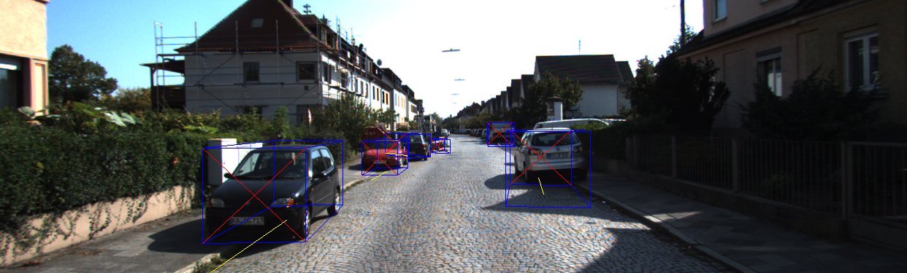
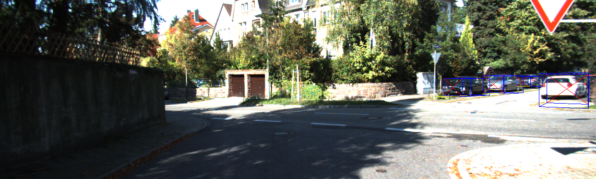
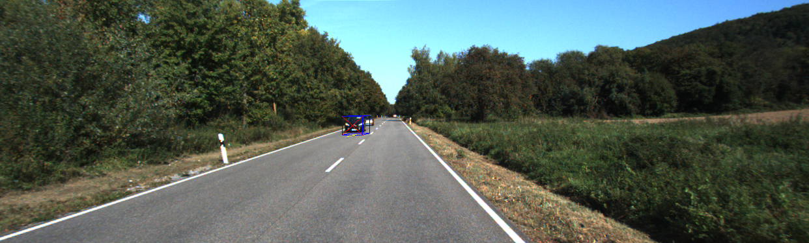
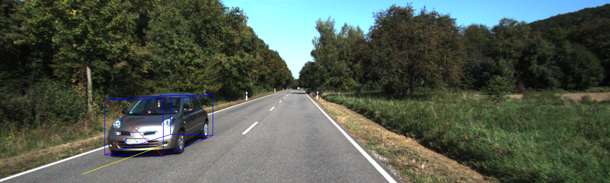
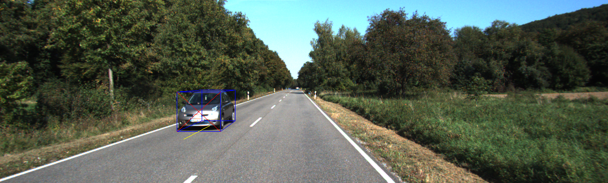

# 3D Bounding Box Estimation Using Deep Learning and Geometry

## Authors

- Ankit Gupta - M23AIR505
- Vikas Kumar Singh - M23AIR545

## Steps
- Get repository for 2d detection "git clone https://github.com/taipingeric/yolo-v4-tf.keras.git"
- Get all the weight files (yolov4.weights, coco_classes.txt, weights.hdf5)
- Create a virtual env using `python -m venv venv` (Python 3.10 is recommended, Python 3.11 has some issues with scikit-learn dependencies for this project)
- Activate the virtual env using `source venv/bin/activate`
- Use `pip install -r requirements.txt` to install the packages
- run prediction.sh to return detections on a single image
- run validation.sh to return detections on a folder of images for eg. test images

## Implementation
- data_prep.ipynb to prepare dataset for Muttibin regressor
- train_3dbb_regressor.ipynb to train and save the model
- get_detection.py first predict 2D bounding boxes using pretrained yolo model given in refrence, predict dimesion and orintation using Muttibin regressor and render_predictions to estimate full 3D bounding box.

## Some results

- Blue box is the 3D bounding box
- Red cross is the front face
- Yellow line is the orientation vector

# References
+ https://arxiv.org/pdf/1612.00496.pdf
+ https://cs.gmu.edu/~amousavi/papers/3D-Deepbox-Supplementary.pdf
+ https://github.com/taipingeric/yolo-v4-tf.keras
+ https://github.com/experiencor/didi-starter/tree/master/simple_solution
+ https://www.cvlibs.net/datasets/kitti/eval_object.php?obj_benchmark=3d